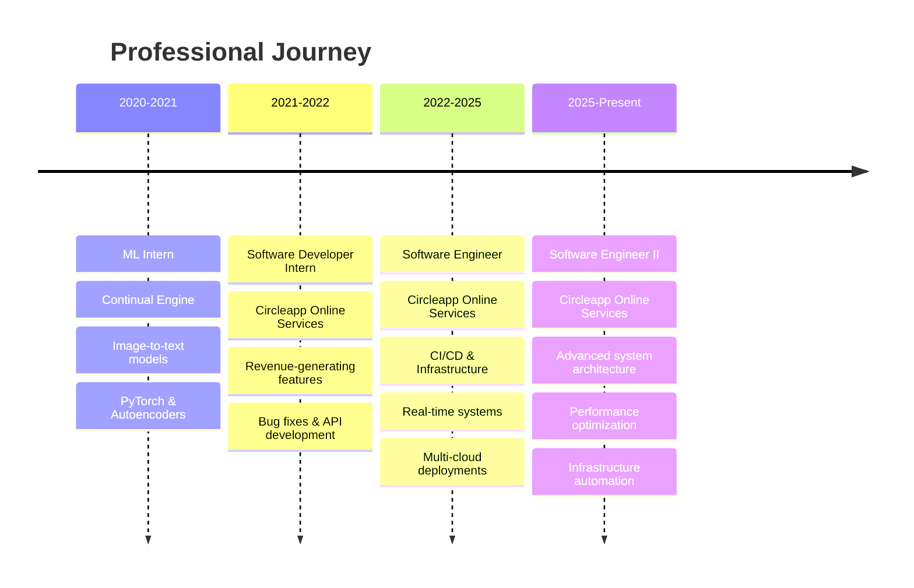

# 👋 Hey there! I'm Gopi Manikanta

  

  
  

---

## 🚀 About Me

> **Building scalable systems that handle high-volume traffic while optimizing for performance and reliability**

🔥 **Software Engineer II** at **Circleapp Online Services** with **3+ years** of hands-on experience
⚡ **Performance Optimization**: Reduced API response times by **200ms** through CDN integration
🌐 **Scale**: Developed high-throughput real-time messaging systems
☁️ **Multi-Cloud Expert**: Proficient across **AWS, GCP, and Azure** platforms

### 🎯 Current Focus
- 🔧 Building robust **CI/CD pipelines** with **GitOps, Kubernetes & Terraform**
- 🏗️ Architecting **microservices** for high-scale social media platforms
- 📱 **Flutter** mobile development experience
- 🔄 Implementing **disaster recovery** and **high availability** solutions

---

## 💼 Professional Experience & Organizations

### 🏢 **Software Engineer II** @ **Circleapp Online Services** 
*April 2025 - Present*

#### 🎯 **Advanced System Architecture & Performance**
- **Infrastructure Leadership**: Managing production Kubernetes clusters across multiple environments with disaster recovery mechanisms
- **Performance Engineering**: Led optimization initiatives reducing API response times by 200ms through strategic CDN integration and gzip compression
- **System Design**: Architecting microservices for PrajaApp social media platform handling high-volume traffic
- **Automation**: Building infrastructure-as-code solutions with Terraform for reproducible deployments

#### 🔧 **Key Technical Initiatives**
- **Multi-Cloud Strategy**: Implementing hybrid cloud solutions across AWS, GCP, and Azure for optimal cost and performance
- **Observability**: Setting up comprehensive monitoring with Grafana, Prometheus, and New Relic for proactive issue detection
- **Security**: Implementing security best practices and compliance measures across infrastructure

---

### 💻 **Software Engineer** @ **Circleapp Online Services**
*May 2022 - March 2025*

#### 🚀 **Core Platform Development**

**Real-time Messaging System** 🔵
- Built a production-grade real-time messaging server from scratch using **WebSockets** and **Socket.io**
- Implemented high-throughput message handling with **Redis** pub/sub for horizontal scaling
- Designed message persistence layer with **MongoDB** for reliability
- Achieved sub-100ms message delivery latency for thousands of concurrent users

**DevOps & CI/CD Excellence** 🔵
- Established and maintained CI/CD pipelines for PrajaApp using **GitOps** methodologies
- Dockerized 15+ microservices for consistent deployment across environments
- Implemented **Kubernetes** deployments with auto-scaling and health checks
- Set up disaster recovery procedures with regular backup automation

**Backend API Development** 🔵
- Developed RESTful APIs using **NestJS** and **Ruby on Rails** serving millions of requests daily
- Created analytical APIs for tracking user activity and engagement metrics
- Built AWS Lambda functions for serverless video processing and thumbnail generation
- Implemented caching strategies with **Redis** to reduce database load by 40%

**Mobile Development** 🔵
- Contributed to **Flutter** mobile applications with cross-platform consistency
- Integrated mobile apps with backend services via REST APIs and WebSocket connections
- Implemented offline-first architecture for improved user experience

#### 📊 **Measurable Impact**
- ⚡ **Performance**: Reduced API response times by 200ms through CDN optimization
- 📈 **Scale**: Built systems handling 10,000+ concurrent users without performance degradation
- 🔧 **Efficiency**: Reduced deployment time by 60% through automated CI/CD pipelines
- 💾 **Reliability**: Achieved 99.9% uptime for critical messaging infrastructure

---

### 👨‍💻 **Software Developer Intern** @ **Circleapp Online Services**
*2021 - 2022*

#### 🎓 **Foundation & Growth**
- Developed revenue-generating features contributing to platform monetization
- Fixed critical bugs and improved application stability
- Built RESTful APIs for core social media features
- Collaborated with senior engineers on architectural decisions
- Participated in code reviews and adopted best practices

**Technologies Used**: Ruby on Rails, PostgreSQL, Redis, Git, Linux

---

### 🤖 **Machine Learning Intern** @ **Continual Engine**
*2020 - 2021*

#### 🧠 **AI/ML Research & Development**
- Built image-to-text conversion models using **PyTorch** deep learning framework
- Implemented **autoencoders** for image feature extraction and compression
- Trained neural networks on large datasets with GPU acceleration
- Optimized model performance and inference speed
- Documented research findings and model architectures

**Technologies Used**: Python, PyTorch, TensorFlow, NumPy, Pandas, Jupyter Notebooks

---

## 🛠️ Technical Expertise & Tools

### 💻 **Programming Languages**

**Practical Usage:**
- **Ruby**: Primary language for Rails backend development, API design, background jobs with Sidekiq
- **Python**: AWS Lambda functions, ML models, automation scripts, data processing
- **TypeScript/JavaScript**: NestJS microservices, Node.js applications, frontend tooling
- **Dart**: Flutter mobile app development for cross-platform applications
- **Bash**: DevOps automation, deployment scripts, system administration

---

### 🌐 **Backend Development & Frameworks**

**Real-world Applications:**
- **Ruby on Rails**: RESTful APIs, MVC architecture, ActiveRecord ORM, Action Cable for WebSockets
- **NestJS**: Microservices architecture, dependency injection, TypeORM, GraphQL APIs
- **Socket.io**: Real-time bidirectional communication, chat systems, live notifications
- **Express.js**: Lightweight APIs, middleware development, routing

---

### ☁️ **Cloud Platforms & Services**

**Cloud Services Expertise:**

**AWS (Amazon Web Services):**
- **Lambda**: Serverless video processing, thumbnail generation, event-driven functions
- **EC2**: Application hosting, auto-scaling groups
- **S3**: Object storage for media files, static assets
- **RDS**: Managed PostgreSQL/MySQL databases
- **CloudFront**: CDN for content delivery and performance optimization
- **ECS/EKS**: Container orchestration
- **CloudWatch**: Logging and monitoring

**Google Cloud Platform (GCP):**
- **Compute Engine**: VM instances for applications
- **Cloud Storage**: Object storage solutions
- **Cloud Functions**: Serverless computing
- **Cloud SQL**: Managed database services

**Microsoft Azure:**
- **Virtual Machines**: Application deployment
- **Azure Storage**: Blob storage solutions
- **Azure Functions**: Serverless applications

---

### 🐳 **DevOps & Container Orchestration**

**DevOps Practices:**
- **Docker**: Multi-stage builds, Docker Compose, container optimization, image security scanning
- **Kubernetes**: Deployments, Services, ConfigMaps, Secrets, Ingress, StatefulSets, DaemonSets
- **Terraform**: Infrastructure as Code (IaC), multi-cloud deployments, state management
- **CI/CD**: GitOps workflows, automated testing, deployment pipelines, rollback strategies
- **GitOps**: ArgoCD, FluxCD for declarative infrastructure

---

### 🗄️ **Databases & Data Storage**

**Database Experience:**
- **PostgreSQL**: Primary relational database, complex queries, indexing, replication
- **MongoDB**: Document storage for messaging, flexible schemas, aggregation pipelines
- **MySQL**: Legacy systems, read replicas for scaling
- **Redis**: Caching layer, session storage, pub/sub messaging, rate limiting

---

### 📱 **Mobile Development**

**Mobile Capabilities:**
- Cross-platform iOS and Android applications
- State management (Provider, BLoC)
- REST API integration
- WebSocket connections for real-time features
- Offline-first architecture
- Native device features integration

---

### 📊 **Monitoring, Observability & Analytics**

**Monitoring Stack:**
- **Grafana**: Custom dashboards, alerting, visualization of metrics
- **Prometheus**: Metrics collection, PromQL queries, service monitoring
- **New Relic**: APM, distributed tracing, performance monitoring
- **ELK Stack**: Centralized logging, log analysis, Kibana visualizations

---

### 🤖 **AI/ML & Data Science**

**ML Experience:**
- Deep learning model development with PyTorch
- Image-to-text conversion models
- Autoencoders for feature extraction
- Data preprocessing and analysis with Pandas
- Model training and optimization

---

### 🔧 **Development Tools & Practices**

**Best Practices:**
- Version control with Git (branching strategies, code reviews)
- Linux system administration and shell scripting
- API testing and documentation
- Test-driven development (TDD)
- Code reviews and pair programming
- Agile/Scrum methodologies

---

## 🌟 Key Features & Projects Developed

| 🚀 **Feature/Project** | 💡 **Business Impact** | 🛠️ **Technologies Used** |
|:---|:---|:---|
| **Real-time Messaging System** | Enabled instant communication for 10K+ concurrent users | WebSockets, Socket.IO, Redis, MongoDB |
| **Social Media Core Features** | High user engagement & retention | NestJS, Flutter, Ruby on Rails, PostgreSQL |
| **CI/CD Pipeline Automation** | 60% faster deployments, reduced errors | Kubernetes, Terraform, GitOps, Docker |
| **Serverless Video Processing** | Automated thumbnail generation at scale | AWS Lambda, Python, S3, CloudFront |
| **API Performance Optimization** | 200ms faster response times | CDN integration, Gzip, Redis caching |
| **Analytical Tracking APIs** | Real-time user behavior insights | NestJS, PostgreSQL, Redis |
| **Multi-Cloud Infrastructure** | Cost optimization & high availability | AWS, GCP, Azure, Terraform |
| **Monitoring & Alerting System** | Proactive issue detection (99.9% uptime) | Grafana, Prometheus, New Relic |
| **Mobile Cross-Platform Apps** | Unified iOS/Android experience | Flutter, Dart, REST APIs |
| **ML Image-to-Text Models** | Automated image content extraction | PyTorch, TensorFlow, Python |

---

## 📊 GitHub Analytics

  
  

  

---

## 🏆 Experience Timeline

---

## 🎓 Education & Certifications

🎓 **B.Tech in Computer Science** - *Rajiv Gandhi University of Knowledge Technologies* (2022)
📊 **GPA**: 9.3/10.0
🏆 **Pre-University Course (MPC)** - *RGUKT* (2018) - GPA: 8.4/10.0

---

## 🌐 Let's Connect!

---

  

---

  <i>⭐ From <a href="https://github.com/itsManikantaGopi">itsManikantaGopi</a> - Building the future, one commit at a time!</i>

