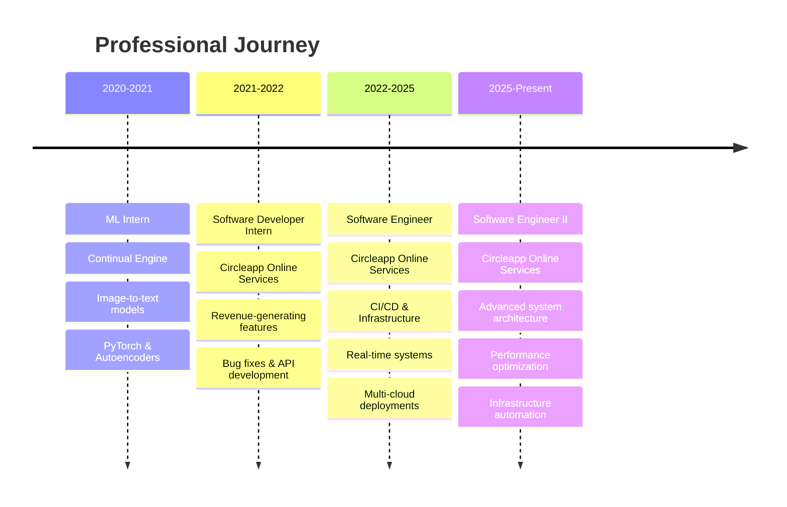

# 👋 Hey there! I'm Gopi Manikanta

  

  
  

---

## 🚀 About Me

> **Building scalable systems that handle high-volume traffic while optimizing for performance and reliability**

🔥 **Software Engineer II** at **Circleapp Online Services** with **3+ years** of hands-on experience
⚡ **Performance Optimization**: Reduced API response times by **200ms** through CDN integration
🌐 **Scale**: Developed high-throughput real-time messaging systems
☁️ **Multi-Cloud Expert**: Proficient across **AWS, GCP, and Azure** platforms

### 🎯 Current Focus
- 🔧 Building robust **CI/CD pipelines** with **GitOps, Kubernetes & Terraform**
- 🏗️ Architecting **microservices** for high-scale social media platforms
- 📱 **Flutter** mobile development experience
- 🔄 Implementing **disaster recovery** and **high availability** solutions

---

## 💼 Professional Highlights

<table>
<tr>
<td width="50%">

### 🏢 **Current Role - Software Engineer II**
**Circleapp Online Services** *(April 2025 - Present)*
**Software Engineer** *(May 2022 - March 2025)*

🔹 **DevOps & Infrastructure**
- Maintain CI/CD pipelines for **PrajaApp** social platform
- Manage **Kubernetes clusters** with disaster recovery
- **Dockerized** multiple applications for consistency

🔹 **Backend Development**
- Built **real-time messaging server** from scratch
- Developed **AWS Lambda functions** for video processing
- Created **RESTful APIs** with optimal performance

</td>
<td width="50%">

### 📈 **Key Achievements**

🎯 **Performance & Scale**
- Performance optimization: **200ms faster APIs**
- Built features with significant business impact

⚡ **Technical Excellence**
- **High-throughput messaging** systems without performance issues
- **Multi-cloud deployments** across AWS/GCP/Azure
- **End-to-end testing** pipelines implementation

🔧 **Innovation**
- Built **analytical APIs** for user activity tracking
- Integrated **CDN with gzip** compression
- **Microservices architecture** for scalability

</td>
</tr>
</table>

---

## 🛠️ Tech Arsenal

### 💻 **Most Used Languages**

### 🌐 **Backend & APIs**

### ☁️ **Cloud & DevOps**

### �️ **Infrastructure as Code & Configuration**

### �📱 **Mobile Development**

### 🗄️ **Databases & Caching**

### 📊 **Monitoring & Analytics**

---

## 📊 GitHub Analytics

  
  

  

---

## 🏆 Experience Timeline

---

## 🌟 Featured Projects & Contributions

| 🚀 **Project** | 💡 **Impact** | 🛠️ **Tech Stack** |
|:---|:---|:---|
| **Real-time Messaging System** | High-throughput message handling | WebSockets, Socket.IO, Redis |
| **Social Media Features** | High-impact user engagement | NestJS, Flutter, AWS |
| **CI/CD Pipeline** | Automated deployments | Kubernetes, Terraform, GitOps |
| **Video Processing Lambda** | Serverless video handling | AWS Lambda, Python |
| **Performance Optimization** | 200ms faster API responses | CDN, Gzip compression |

---

## 🎓 Education & Certifications

🎓 **B.Tech in Computer Science** - *Rajiv Gandhi University of Knowledge Technologies* (2022)
📊 **GPA**: 9.3/10.0
🏆 **Pre-University Course (MPC)** - *RGUKT* (2018) - GPA: 8.4/10.0

---

## 🌐 Let's Connect!

---

  

---

  <i>⭐ From <a href="https://github.com/itsManikantaGopi">itsManikantaGopi</a> - Building the future, one commit at a time!</i>

